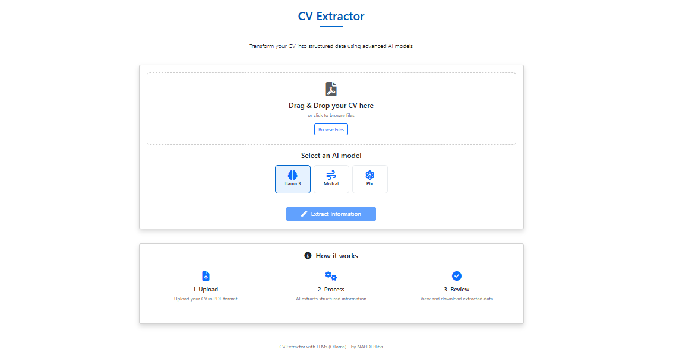
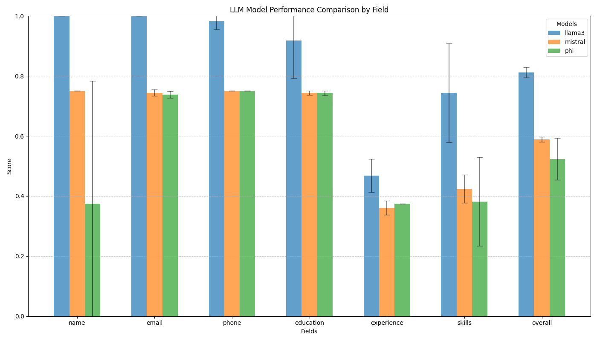

# CV Extractor Project

Extract structured information from CVs and resumes with AI precision.



## 🔍 Overview

This project extracts structured information from CVs/resumes using PDF processing techniques and LLM-powered text analysis. It features a comprehensive evaluation system to compare the performance of different language models.

## ✨ Features

- 📄 **PDF Text Extraction**: Extract text from digital PDFs with PyMuPDF
- 🔍 **Advanced OCR**: Process scanned documents with Google's Gemini model
- 🤖 **Multi-Model Support**: Compare extractions from multiple LLMs
- 🌐 **Web Interface**: Upload and process CVs through a browser
- 🔌 **API Access**: Programmatic access for integration
- 📊 **Detailed Analytics**: Compare model performance with metrics
- 💾 **Structured Output**: Results formatted in consistent JSON
- 📚 **Batch Processing**: Process multiple CVs in one go

## 🚀 Getting Started

### Docker Setup

```bash
# Build the Docker image
docker build -t cv-extractor .

# Run the container
docker run -p 5000:5000 -v $(pwd)/data:/app/data -v $(pwd)/evaluation_reports:/app/evaluation_reports -e "GEMINI_API_KEY=your_key_here" cv-extractor
```

### Local Setup

1. **Clone the repository**

```bash
git clone https://github.com/yourusername/cv_extractor_project.git
cd cv_extractor_project
```

2. **Set up a virtual environment**

```bash
python -m venv venv
# On Windows
venv\Scripts\activate
# On macOS/Linux
source venv/bin/activate
```

3. **Install dependencies**

```bash
pip install -r requirements.txt
```

4. **Configure environment variables**

```bash
cp .env.example .env
# Edit .env with your API keys and paths
```

> **Model Access Options:** 
> - Configure Ollama for local model inference (recommended for privacy)
> - Or set up an OpenRouter API key for cloud-based model access (alternative if Ollama setup is problematic)
> - System will automatically use OpenRouter if Ollama is unavailable

5. **Start the application**

```bash
python scripts/app.py
```

## 🖥️ System Requirements

- **Operating System**: Windows 10+, macOS 10.15+, or Linux (Ubuntu 18.04+)
- **Python**: 3.9 or higher
- **RAM**: 12GB minimum, 16GB recommended
- **Storage**: 500MB for application, plus space for CV storage
- **Dependencies**:
  - Poppler (for PDF processing)
  - CUDA-compatible GPU (optional, for faster processing)

## 🧠 Models Supported

| Model        | Provider      | Type          | Best For              | Integration |
|--------------|---------------|---------------|------------------------|------------|
| Llama3       | Ollama/Meta   | Local/API     | Overall extraction     | Direct/OpenRouter |
| Mistral      | Mistral AI    | API           | Education & experience | OpenRouter |
| Phi-3        | Microsoft     | API           | Basic fields           | OpenRouter |
| GPT-4        | OpenAI        | API           | Complex documents      | Direct     |
| Gemini 1.5 Flash | Google    | API           | OCR & image extraction | Direct     |

> **Note:** For users experiencing issues with Ollama, the system provides automatic fallback to OpenRouter API for accessing models like Llama3, ensuring uninterrupted service.

## ⚙️ How It Works

1. **Document Processing**:
   - PDF text extraction using PyMuPDF
   - Image-based PDFs processed with OCR via Gemini 1.5 Flash
   - Text cleaning and normalization

2. **Information Extraction**:
   - Structured prompting to LLMs
   - Field-specific extraction patterns
   - Fallback mechanisms between models
   - Automatic switching between Ollama (local) and OpenRouter (cloud) as needed

3. **Result Processing**:
   - JSON formatting and validation
   - Confidence scoring for extracted fields
   - Structure normalization

4. **Evaluation Pipeline**:
   - Ground truth comparison
   - Field-specific metrics
   - Cross-model performance evaluation

## 📊 Model Performance

Our evaluation system compares model performance across different CV fields:

| Model   | Name  | Email | Phone | Skills | Education | Experience | Overall |
|---------|-------|-------|-------|--------|-----------|------------|---------|
| Llama3  | 1.00  | 1.00  | 0.98  | 0.74   | 0.92      | 0.47       | 0.81    |
| Mistral | 0.75  | 0.74  | 0.75  | 0.42   | 0.74      | 0.36       | 0.59    |
| Phi     | 0.38  | 0.74  | 0.75  | 0.38   | 0.74      | 0.38       | 0.52    |



## 💡 Usage Instructions

### Web Interface

Access the web interface at `http://localhost:5000` after starting the application.

1. Upload your CV (PDF format)
2. Select models to use for extraction
3. Click "Process CV"
4. View structured results and download as JSON

### API Usage

```bash
# Basic usage
curl -X POST -F "pdf_file=@/path/to/your/cv.pdf" -F "models=llama3" http://localhost:5000/api/extract

# Multiple models
curl -X POST -F "pdf_file=@/path/to/your/cv.pdf" -F "models=llama3,mistral,phi" http://localhost:5000/api/extract

# With specific parameters
curl -X POST -F "pdf_file=@/path/to/your/cv.pdf" -F "models=llama3" -F "confidence_threshold=0.7" http://localhost:5000/api/extract
```

### Command-line Processing

Process all PDFs in the input directory:

```bash
python scripts/pdf_extractor.py --input_dir data/input --output_dir data/output
```

Process extracted text with LLMs:

```bash
python scripts/llm_processor.py --input_dir data/output --output_dir data/results --models llama3,mistral
```

## 🔍 Evaluation System

### Running an Evaluation

To evaluate model performance:

```bash
python run_evaluation.py
```

This script will:
1. Read and normalize all ground truth files
2. Process model results
3. Generate test results for missing model-CV combinations
4. Calculate performance metrics
5. Create visualizations and reports

### Adding Custom Evaluation Data

1. **Create ground truth files**:
   - Add JSON files to `data/ground_truth/` named like `gt1.json`, `gt2.json`, etc.
   - Follow the existing format with fields like "Name", "Email", "Phone", "Skills", etc.

2. **Add model results**:
   - Process CVs with your models
   - Save results to `data/results/` with model name in the filename

## 📁 Directory Structure

```
cv_extractor_project/
├── data/                     # Data directories
│   ├── input/                # CV PDFs to process
│   ├── output/               # Extracted text files
│   ├── output1/              # Additional output files
│   ├── ground_truth/         # Manual annotations for evaluation
│   └── evaluation/           # Processed evaluation data
├── evaluation_reports/       # Generated evaluation visualizations
├── scripts/                  # Core scripts
│   ├── app.py                # Flask web application
│   ├── pdf_extractor.py      # PDF text extraction
│   └── llm_processor.py      # LLM integration
├── templates/                # Flask HTML templates
├── static/                   # Static CSS and JS files
├── evaluation.py             # Evaluation framework
├── run_evaluation.py         # Evaluation pipeline
├── pipeline.py               # Processing pipeline
├── run_web.py                # Web application launcher
├── EVALUATION_REPORT.md      # Detailed evaluation findings
├── Dockerfile                # Container definition
├── docker-compose.yml        # Docker orchestration
├── requirements.txt          # Python dependencies
├── .env                      # Environment variables
├── .env.example              # Example environment variables
└── README.md                 # Project documentation
```

## 📄 License

[MIT License](LICENSE)

## 🙏 Acknowledgements

- Google's Gemini 1.5 Flash API for OCR capabilities
- PyMuPDF for PDF processing
- Ollama for local LLM inference 

## 🐳 Dockerization

The project includes Docker support for easy deployment and consistent runtime environment.

### Building and Running with Docker Compose

The simplest way to run the application:

```bash
# Build and start the container
docker-compose up -d

# View logs
docker-compose logs -f

# Stop the container
docker-compose down
```

### Building and Running with Docker

If you prefer using Docker directly:

```bash
# Build the Docker image
docker build -t cv-extractor .

# Run the container
docker run -p 5000:5000 -v $(pwd)/data:/app/data -v $(pwd)/evaluation_reports:/app/evaluation_reports -e "GEMINI_API_KEY=your_key_here" cv-extractor
```

### Container Details

- Base image: Python 3.9 (slim)
- Exposed port: 5000
- Mounted volumes:
  - `./data:/app/data`: Persists all data files
  - `./evaluation_reports:/app/evaluation_reports`: Stores evaluation outputs
- Dependencies: Includes Poppler for PDF processing and other required system libraries

### Environment Variables

Environment variables can be set in the `.env` file or passed directly to the container:

```bash
docker run -p 5000:5000 -v $(pwd)/data:/app/data -v $(pwd)/evaluation_reports:/app/evaluation_reports -e "GEMINI_API_KEY=your_key_here" cv-extractor
```

## 🔧 Troubleshooting

### Common Issues

1. **PDF Processing Failures**
   - Ensure Poppler is correctly installed and its path is set in `.env`
   - For image-based PDFs, verify your Gemini API key is valid
   - Try using the alternate PDF processing method by setting `OCR_ENABLED=false`

2. **Model Access Problems**
   - If Ollama is not working, ensure OpenRouter API key is configured
   - Check network connectivity to API endpoints
   - Verify model names match those available in Ollama or OpenRouter

3. **Missing Directories**
   - All required directories are created automatically when running the application
   - Manually create any missing directories if errors occur
   - Docker volumes should be properly mounted to persist data

4. **Docker Container Issues**
   - Ensure ports are not already in use: `lsof -i :5000` or `netstat -ano | findstr :5000`
   - Check container logs: `docker-compose logs -f`
   - Verify environment variables are properly passed to the container

### Getting Help

If you encounter issues not addressed above:
1. Check the logs in the console or container output
2. Ensure all dependencies are correctly installed
3. Open an issue in the project repository with detailed error information 